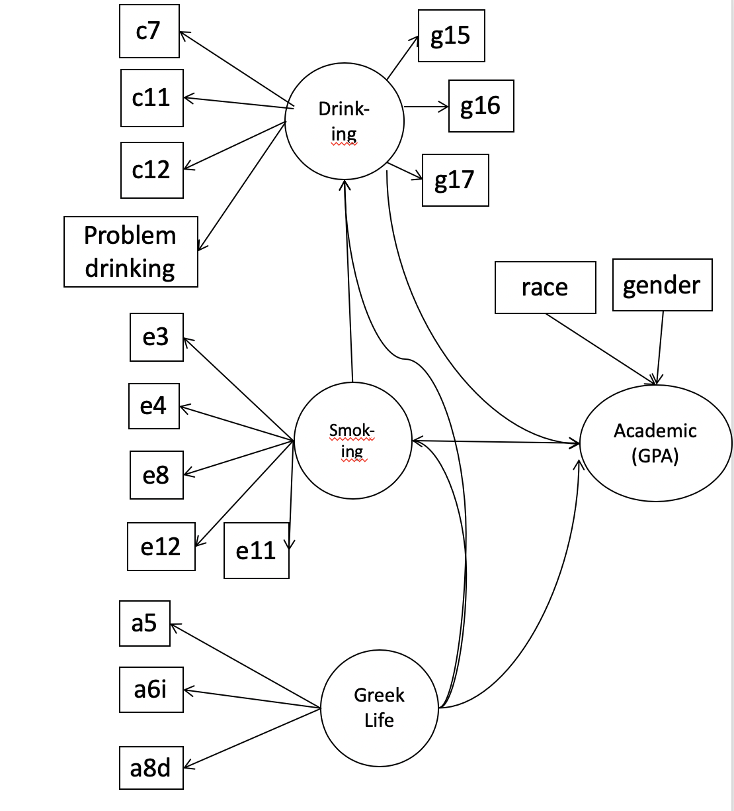
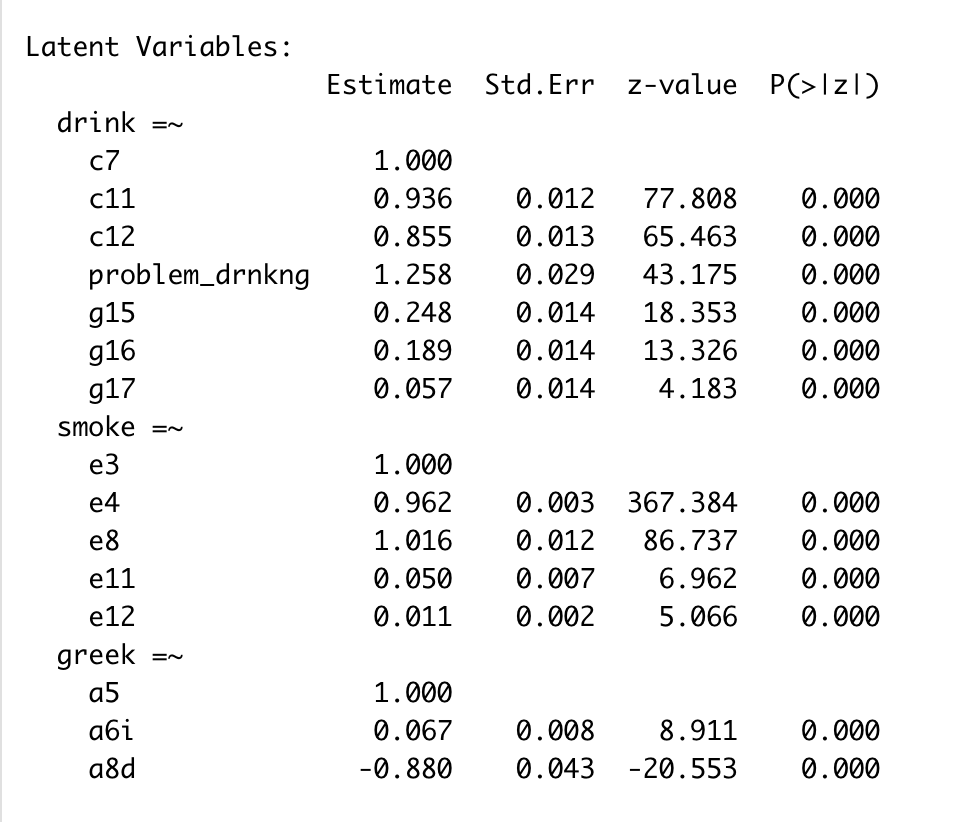
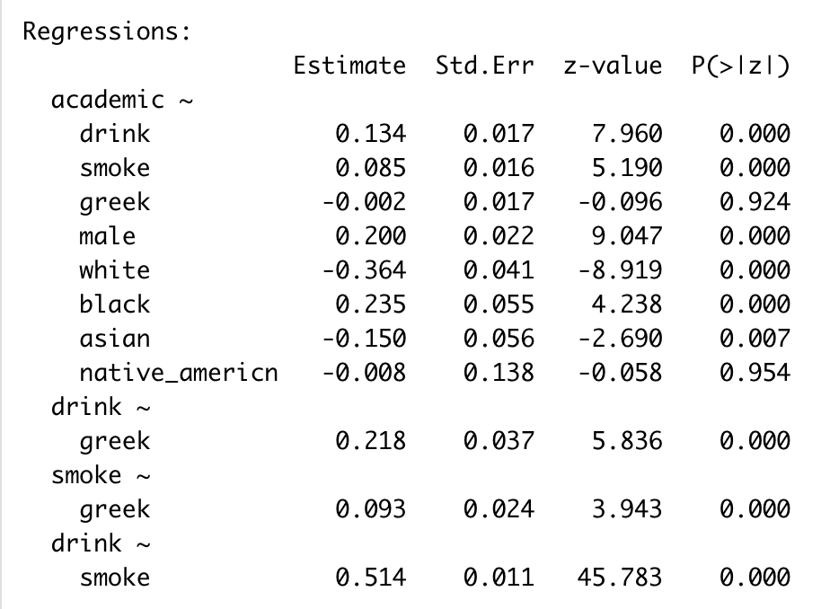

```{r setup, include=FALSE}
knitr::opts_chunk$set(tidy=FALSE, warning=FALSE, message=FALSE, cache=TRUE, 
               comment=NA, verbose=TRUE, fig.width=5, fig.height=3,echo=FALSE)

library(corrplot)
library(naniar)
library(ggplot2)
library(dplyr)
library(tibble)
library(tidyr)
library(purrr)
library(lme4)
library(ggpubr)
library(stringr)
library(ggmosaic)
library(MASS)
load("eda.rdata")
#save.image(file = "eda.rdata")
theme_set(theme_bw())
```


## Introduction

- Data: 2001 College Alcohol Study, 10904 observations respectively
- Goal: How do drinking and smoking affect academic performance?
- Challenges: High correlation between individual variables (survey data)
- Solution: latent factor based model
- Model: 
  - Structural Equation Model (SEM): studying interrelationships among observed and latent variables 
  - Build SEM for 2001 

## EDA: Relation between drinking behavior and GPA

- Students with higher GPAs (A coded as 1) show lower alcohol use

```{r edadrinking}
dat_01 %>%
  dplyr::select(c7,c11,c12,problem_drinking,f5) %>% 
  mutate(f5=f5%>%
    factor(x = .,levels = 1:9,labels =  c("A","A-","B+","B","B-","C+","C","C-","D"))) %>%
  gather(data=.,key = key,value = value,-f5) %>% 
  ggplot(aes(x=value,fill=f5)) +
    facet_wrap(~ key, scales = "free") +
    geom_bar(position = "fill")
```


## EDA: Relation between smoking behavior and GPA

Similarly, students with high GPAs show less smoking, but the correlation is less clear (E4 shows many students who smoke more than one pack a day with high GPA)

```{r eda smookinggpa2}
dat_01 %>%
  dplyr::select(e3,e4,e8,e11:e12,f5) %>% 
  mutate(f5=f5%>%
    factor(x = .,levels = 1:9,labels =  c("A","A-","B+","B","B-","C+","C","C-","D"))) %>%
  gather(data=.,key = key,value = value,-f5) %>% 
  ggplot(aes(x=value,fill=f5)) +
    facet_wrap(~ key, scales = "free") +
    geom_bar(position = "fill")
```

## EDA: Relation between drinking/smoking and background 

Heavier use of alcohol and cigarettes is related to

- Member of a fraternity/sorority
- Live in fraternity/sorority 
- Think fraternity/sorority life is important
- Mother/father drinks
- Family accepting of heavy drinking

Heavier use of alcohol relate to 

- male

## EDA: Relation between drinking/smoking and background 

```{r eda bkgdri,fig.width=6, fig.height=5, eval=FALSE, include=FALSE}
dat_01 %>%
  dplyr::select(a2,a5,a6,a8d,g3,g15,g16,g17,c7) %>% 
  mutate(c7=case_when(
    c7==1 ~ "abstainer",
    c7==2 ~ "former",
    c7==3 ~ "infrequent",
    c7==4 ~ "light",
    c7==5 ~ "moderate",
    c7==6 ~ "heavy",
    c7==7 ~ "problem"
  )%>%factor(x = .,levels = c("abstainer","former","infrequent","light","moderate","heavy","problem")
           ))%>%
  gather(data=.,key = key,value = value,-c7) %>% 
  ggplot(aes(x=value,fill=c7)) +
    facet_wrap(~ key, scales = "free") +
    geom_bar(position = "fill")
```


```{r eda bkg, eval=FALSE, include=FALSE}
dat_01 %>%
  dplyr::select(a5,a6,a8d,g3,g6,g7,g8,g15,g16,e3) %>% 
  mutate(smoke=if_else(e3==1,"non-smoke","smoke")%>%as.factor())%>%
  dplyr::select(-e3,-g7,-g8)%>%
  gather(data=.,key = key,value = value,-smoke) %>% 
  ggplot(aes(x=value,fill=smoke)) +
    facet_wrap(~ key, scales = "free") +
    geom_bar(position = "fill")
```

## Data Preprocessing
- Obtain the complete cases based on questions of interest with no screening (keep 87.5%)
- Impute the NA's based on the relation to other questions
- Create problem_drinking counting how many times a student cause problems because of drinking


## Pick variables 

- Academic (ordinal response variable): F5 (GPA)
- Drinking:
    - C7: Self-identified alcohol use (abstainer/former drinker/...)
    - C11: Frequency of drinking
    - C12: Amount of alcohol consumed when drinking
    - problem_drinking (C17): how often has your drinking caused you to ...
    - G15,G16,G17: Alcohol use in family
- Smoking:
    - E3: Frequency of mmoking
    - E4: Average number of cigarettes per day
    - E8: Social smoking (alone vs. with friends)
    - E11-12: How often exposed to smoking
- Background:
    - Fraternity/Sorority: A5,A6,A8d
    - Gender,Race: A2,G3a-e

## Model

$$
\begin{aligned}
  &\boldsymbol{y}=\boldsymbol{\nu}+\boldsymbol{\Lambda} \boldsymbol{\eta}+\boldsymbol{\epsilon}\\
  &\boldsymbol{\eta}=\boldsymbol{\alpha}+\boldsymbol{B} \boldsymbol{\eta}+\boldsymbol{\zeta}
\end{aligned}
$$

- $\boldsymbol{\Lambda}$ is the factor loading matrix,
- $\boldsymbol{\eta}$ are the latent factors that are not observable, e.g., drinking tendency,
- $\boldsymbol{\nu}$ and $\boldsymbol{\alpha}$ are intercepts for the observational and latent variables respectively, 
- $\boldsymbol{\epsilon}$ and $\boldsymbol{\zeta}$ are residuals that are normally distrubuted. 
- $\boldsymbol{B}$ measures the conditional dependency across latent variables. If $\boldsymbol{B}_{ij}\neq 0$, then $\boldsymbol{\eta}_i$ is a child of $\boldsymbol{\eta}_j$, i.e., there exists a directed edge from factor $j$ to $i$.

For the ordinal questionnaire data, the continuous $\boldsymbol{y}$ is assumed to be a normal latent variable that underlies the observable questionnaire response $\boldsymbol{z}$, where $z=m$ if $y\in[\tau_{m-1}, \tau_m]$ and $\tau$ is the threshold.

## Model

```{r graph, echo=FALSE,  out.width = '70%', fig.align='center'}

```


## Results

```{r lvar, echo=FALSE,  out.width = '80%', fig.align='center'}
#
```

## Results

```{r reg, echo=FALSE,  out.width = '80%', fig.align='center'}
#
```

## Interpretation 

-Latent Variables: All coeffiecients are positive and all have significant p-value. We trust these variables constitute latent variables.
-Regressions: Drinking and smoking associated with lower GPA (A is coded as 1)
-Greek life not significant directly on academic performance, but highly correlated with drinking.

## Discussion

- Data imputation-probably missing not at random
- Comparison between 1997 to 2001 to study the trend
- Explore effect of greek life more rigorously through Mediation Analysis