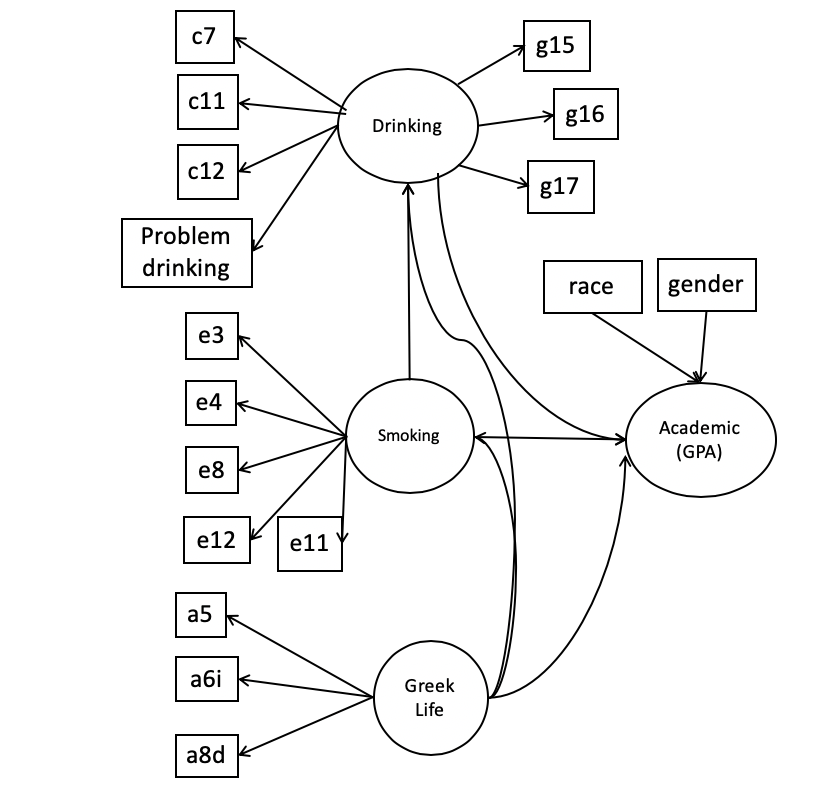
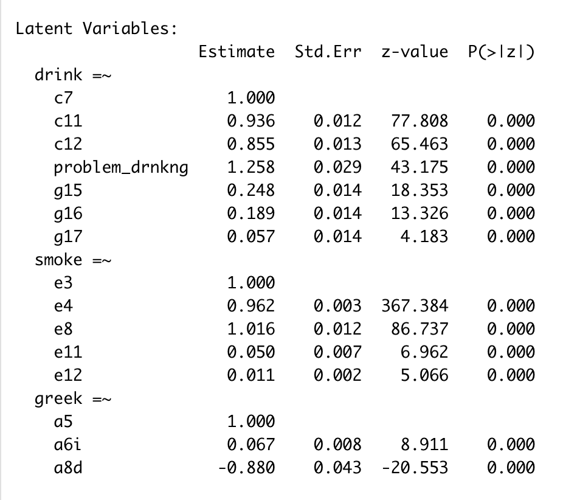
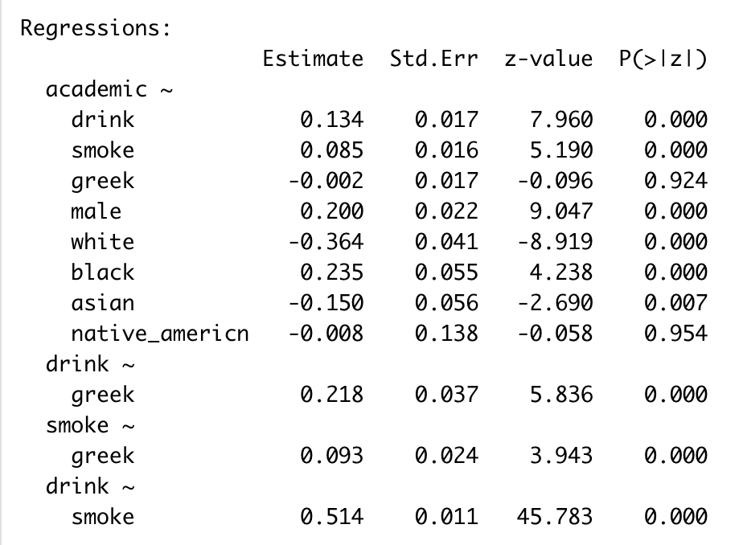

\fontsize{10}{11}
\selectfont

##### Abstract

We aim to examine the relationship between smoking and drinking behaviors on academic performance of college students. Our data comes from Harvard School of Public Health survey on alcohol and drug use among college students conducted in 2001. We apply a structural equation model to construct latent factors for drinking and smoking behavior, and explore their relationship to GPA with adjusting the potential effects from Greek life and other background such as gender and race. Our result suggests heavy use of alcohol/cigarette may relate to worse academic performance, and use of alcohol and cigarette is positively correlated. In addition, active participation in Greek life may influence the academic performance though drinking and smoking.

#### 1. Introduction

The data we are studying is from a Harvard School of Public Health survey on alcohol and drug use among college students. The study was conducted over the span of a decade, with surveys administered in years 1993, 1997, 1999, and 2001, and it hoped to identify relationships between high risk behaviors and factors such as campus drinking culture, college drinking policies, and prevalence of greek life. 

For this paper, we are interested in examining the relationship between smoking and drinking behaviors on academic performance of college students surveyed in 2001. As is the case with many surveys in behavioral and social studies, the smoking and drinking behaviors are measured indirectly through several highly correlated items in the questionaire. We therefore use a Structural Equation Model (SEM) [@muthen1984general] to summarize a large number of variables into a smaller set of latent variables, and study the interrelationships among observed variables and latent variables. 

#### 2. Materials and Methods

##### 2.1 Data cleaning and transformations

The variables have widely varying rates of missingness because respondents are instructed to skip certain questions based on previous answers. Therefore, to prepare our dataset for analysis, we first identified the questions relating to smoking and drinking that were not predicated on previous responses (E3, E4, C5), and retain only the complete cases among these. This left us with 88.5% of the data. The missingness in the other variables in question was imputed based on previous responses. For example, when the survey instructs those who have not had a drink in the last 30 days to skip the C11 ("How many times have you had a drink in the last 30 days?"), we imputed the missing responses as zero. 

##### 2.2 Structural Equation Model

A structural equation model (SEM) is built with two components. The first component is a measurement model (equation (1)), or confirmatory factor analysis (CFA), which summarize highly correlated observed variables to latent variables with taking measurement errors into consideration. The second component is a strutural model (equation (2)), or structural regression model studying relationships between the latent factors. 

$$
\begin{aligned}
  &\boldsymbol{y}=\boldsymbol{\nu}+\boldsymbol{\Lambda} \boldsymbol{\eta}+\boldsymbol{\epsilon}& (1)\\
  &\boldsymbol{\eta}=\boldsymbol{\alpha}+\boldsymbol{B} \boldsymbol{\eta}+\boldsymbol{\zeta}& (2)
\end{aligned}
$$
where $\boldsymbol{\Lambda}$ is a $n\times p$ factor loading matrix, $\boldsymbol{\eta}$ is a $p\times 1$ latent factor vector that is not observable, e.g., drinking behaviour. $\boldsymbol{\nu}$ and $\boldsymbol{\alpha}$ are intercepts. $\boldsymbol{\epsilon}$ and $\boldsymbol{\zeta}$ are residuals that are normally distributed. Typically, $\boldsymbol{\epsilon}$ and $\boldsymbol{\zeta}$ are assumed to possess a covariance structure. The $p\times p$ matrix $\boldsymbol{B}$ measures the conditional dependency across latent variables. If $\boldsymbol{B}_{ij}\neq 0$, then factor $\boldsymbol{\eta}_i$ is a child of $\boldsymbol{\eta}_j$, i.e., there exists a directed edge from factor $j$ to $i$. $\boldsymbol{I}-\boldsymbol{B}$ is invertible and identifiability constraints are applied.

The interpretation of $y$ depends on the type of data in the questionnaire. For the continuous questionnaire response, $y$ is the exact response value. For the ordinal response, the continuous $\boldsymbol{y}$ is assumed to be a normal latent variable that underlies the observable questionnaire response $\boldsymbol{z}$, where $z=m$, if $y\in[\tau_{m-1}, \tau_m]$ and $-\infty=\tau_0<\tau_1<\cdots<\tau_K=+\infty$ are the thresholds.

In our setting, we aim to construct latent variables representing "Drinking Behavior", "Smoking Behavior" and "Academic Performance". The latent factor for "Greek Life" is also introduced since it may have potential influence on both drinking/smoking behavior and academic performance. We assume that "Smoking Behavior" can be explained by "Greek Life", "Drinking Behavior" can be explained by both "Greek Life" and "Smoking Behavior", and "Academic" can be explained by all latent factors together with background variables such as gender and race. The model is shown in Figure \ref{fig:graph}

```{r daggraph, echo=FALSE,  out.width = '40%', fig.align='center', fig.cap="\\label{fig:graph}The directed acyclic dependency graph between variables. Observable responses are marked in square and factors are marked in circle." }

```

We choose the variables which were similar enough to construct a coherent latent variable that would be easy to interpret, but diverse enough to capture a broad collection of behaviors. We also prefer ordinal variables and variables with less missing values. For "Drinking Behavior" latent variable, we used variables relating to self-identification of drinking behavior (C7), frequency (C11) and amount(C12) of drinking over the last 30 days (C11), and the use (G15,G17) and altitude (G16) in family. Lastly, we used a "problematic drinking" variables, which was the sum of the number of more extreme signs of alcoholism that responded had exhibited in the last 30 days, reported in C17. For "Smoking Behavior" latent variable, we used frequency of smoking over the last 30 days (E3), amount of cigarettes smoked on average (E4), whether the respondent smoked only on their own or with others (E8), and how often exposed to smoking (E11,E12). For academic performance, we consider the  To construct the "Greek Life" latent variable, we used whether or not the respondent was a member of greek life (A4), whether or not they lived in their fraternity or sorority (A5), and whether or not they had indicated that greek life was important to them (A8d). 

#### 3. Results

##### 3.1 Exploratory Data Analysis

Data exploration suggests heavier use of alcohol is related to worse academic performance. As shown in Figure \ref{fig:drigpa}, as the increase of the level of each item (heavier use of alcohol), the proportion of higher GPA students decrease. Especially, students with extreme high level on `problem drinking` are all students with GPA less than A-. Figure \ref{fig:smogpa} suggests the increasing proportion of higher GPA is related to increasing use of cigarretes and less exposed to smoking environment. Figure \ref{fig:smobkg} and \ref{fig:dribkg} suggest heavier use of alcohol/cigarette relate to active participation in Greek life or heavier use of alcohol/cigarette in family. 

##### 3.2 Main Results

We conducted the analysis by apply R package `lavaan`[@rosseel2012lavaan]. Table \ref{tbl:measure} presents the result for the measurement model, depicting the factor loading matrix. All the items are significant showing they are clear indicators for latent factors. And the signs align with our expectation. For the survey, the answers are encoded in the way that lower value represent a better lifestyle. For example, the abstainer is encoded as 1 in question c3. Therefore all the signs are reasonable. As a result, lower value of drinking/smoking factor corresponds to light use of alcohol/cigarette. And lower level of greek life factor presents less participation to greek life. Notice that low value of a8d indicates the greek life is very important for students, resulting in the negative sign. 

Table \ref{tbl:structure} presents the relationship between the latent factors. Drinking and smoking are significantly related to the academic performance. Specifically, lower level of smoking/drinking is related to better academic performance. And smoking and drinking are positive correlated. It is worth noting although greek life does not have directly influence on academic performance, but it may indirectly influence academic performance through drinking and smoking. A mediation analysis is needed for further exploration.

In terms of model fit evaluation, the fit statistics of our model is RMSEA $0.03$ (<0.08), CFI $1.00$ (>0.95) and SRMR $0.02$ (<0.06). We have strong evidence that this model achieves a good fit as suggested by [@hu1999cutoff].

##### 3.3 Sensitivity Analysis

We conduct a sensitivity analysis on the specification of covariance matrix of residuals in our model. We compare the result based on a structured covariance and unstructured covariance. The result still holds since the p-values and the signs of the estimator stay the same and only slight changes of the esimators. This suggests our model is relatively robust.

#### 5. Discussion

We might have improved our analysis through a different construction of our latent variables. For example, when designing the "Problematic Drinking" variable, our choice to include an indicator for respondents who exhibitted a behavior three times or more in the last 30 days was arbitrary. In fact, since having a hangover (C17a) is a much less severe indication of alcohol abuse than requiring medical treatment for alcohol overdose (C17l), we could have used different benchmarks for each variable when determining whether a response was truly a problematic drinking behavior.

In future studies, we would also like to follow up on these results through mediation analysis. As we saw, our greek life latent variable was not significantly correlated with academic performance, but it was highly correlated with heavy drinking, which in tern was significantly correlated with worse academic performance. Since structural equation models do not lend themselves to interaction effects, one approach to investigate this further would be through mediation analysis. 

\newpage

#### Appendix

```{r setup, include=FALSE}
knitr::opts_chunk$set(tidy=FALSE, warning=FALSE, message=FALSE, cache=TRUE, 
               comment=NA, verbose=TRUE, fig.width=5, fig.height=3,echo=FALSE)

library(corrplot)
library(naniar)
library(ggplot2)
library(dplyr)
library(tibble)
library(tidyr)
library(purrr)
library(lme4)
library(ggpubr)
library(stringr)
library(ggmosaic)
library(MASS)
library("lavaan")
library(lavaanPlot)
load("eda.rdata")
load("model.rdata")
#save.image(file = "eda.rdata")
theme_set(theme_bw())
```

```{r edadrinking,fig.cap="\\label{fig:drigpa}Relation between drinking behavior and GPA"}
dat_01 %>%
  dplyr::select(c7,c11,c12,problem_drinking,f5) %>% 
  mutate(f5=f5%>%
    factor(x = .,levels = 1:9,labels =  c("A","A-","B+","B","B-","C+","C","C-","D"))) %>%
  gather(data=.,key = key,value = value,-f5) %>% 
  ggplot(aes(x=value,fill=f5)) +
    facet_wrap(~ key, scales = "free") +
    geom_bar(position = "fill")
```

```{r eda smookinggpa2,fig.cap="\\label{fig:smogpa}Relation between smoking behavior and GPA"}
dat_01 %>%
  dplyr::select(e3,e4,e8,e11:e12,f5) %>% 
  mutate(f5=f5%>%
    factor(x = .,levels = 1:9,labels =  c("A","A-","B+","B","B-","C+","C","C-","D"))) %>%
  gather(data=.,key = key,value = value,-f5) %>% 
  ggplot(aes(x=value,fill=f5)) +
    facet_wrap(~ key, scales = "free") +
    geom_bar(position = "fill")
```

```{r eda bkgdri,fig.width=6, fig.height=5,fig.cap="\\label{fig:dribkg}Relation between drinking and background"}
dat_01 %>%
  dplyr::select(a2,a5,a6,a8d,g3,g6,g7,g8,g15,g16,c7) %>% 
  mutate(c7=case_when(
    c7==1 ~ "abstainer",
    c7==2 ~ "former",
    c7==3 ~ "infrequent",
    c7==4 ~ "light",
    c7==5 ~ "moderate",
    c7==6 ~ "heavy",
    c7==7 ~ "problem"
  )%>%factor(x = .,levels = c("abstainer","former","infrequent","light","moderate","heavy","problem")
           ))%>%
  gather(data=.,key = key,value = value,-c7) %>% 
  ggplot(aes(x=value,fill=c7)) +
    facet_wrap(~ key, scales = "free") +
    geom_bar(position = "fill")
```

```{r eda bkg,fig.cap="\\label{fig:smobkg}Relation between smoking and background"}
dat_01 %>%
  dplyr::select(a5,a6,a8d,g3,g6,g7,g8,g15,g16,e3) %>% 
  mutate(smoke=if_else(e3==1,"non-smoke","smoke")%>%as.factor())%>%
  dplyr::select(-e3,-g7,-g8)%>%
  gather(data=.,key = key,value = value,-smoke) %>% 
  ggplot(aes(x=value,fill=smoke)) +
    facet_wrap(~ key, scales = "free") +
    geom_bar(position = "fill")
```

```{r sum}
summarize_lavaan=function(fit){
  a=summary(fit)
  start=which(a$PE$op=="~") %>% min()
  end=which(a$PE$op=="~") %>% max()
  table=a$PE[start:end,5:8] %>% round(2)
  rownames(table)=paste(a$PE[start:end,1],a$PE[start:end,2],a$PE[start:end,3])
  colnames(table)=c("estimate","SE","z-score","P-value")
  return(table)
}

categorize=function(dat,var_names=colnames(dat)){
  for (name in var_names){
    med=dat_01f[,name] %>% unlist %>% median #find medians
    dat[,name]=ifelse(dat[,name]>=med, 1, 0)
  }
  dat=rbind(dat,rep(2,dim(dat)[2]))
  return(dat)
  
}

```


```{r sem, eval=FALSE, include=FALSE}
model <- '
  # measurement model
     drink=~ c7 + c11 + c12 + problem_drinking + g15 + g16 + g17
     smoke=~ e3 + e4 + e8 + e11 + e12
     greek=~ a5 + a6i + a8d
  # regressions
    academic ~  drink + smoke + greek + male + white + black + asian +native_american
    drink ~ greek 
    smoke ~ greek 
    drink ~ smoke
  # residual correlations
   e11~~e12
   c11~~c12
   c7~~c11
   c7~~c12
   c7~~problem_drinking
   e3~~e4
   a6i~~a8d
   a5~~a8d
   g15~~g16
   g15~~g17
   g16~~g17
'
fit_01_non_overlap <- sem(model, data=dat_01f, ordered = c("c7","c11","c12","e3","e4","e8","academic","a5","a8d","g15","g16","g17"))
fit_01_non_overlap %>% fitmeasures()

model <- '
  # measurement model
     drink=~ c7 + c11 + c12 + problem_drinking + g15 + g16 + g17
     smoke=~ e3 + e4 + e8 + e11 + e12
     greek=~ a5 + a6i + a8d
  # regressions
    academic ~  drink + smoke + greek + male + white + black + asian +native_american
    drink ~ greek 
    smoke ~ greek 
    drink ~ smoke
'
fit_01_non_overlap <- sem(model, data=dat_01f, ordered = c("c7","c11","c12","e3","e4","e8","academic","a5","a8d","g15","g16","g17"))
```

```{r lvar, echo=FALSE,  out.width = '80%', fig.align='center',fig.cap="\\label{tbl:measure}Result of Measurement Models"}

```

```{r reg, echo=FALSE,  out.width = '80%', fig.align='center',fig.cap="\\label{tbl:structure}Result of Structural Models"}

```

#### References


